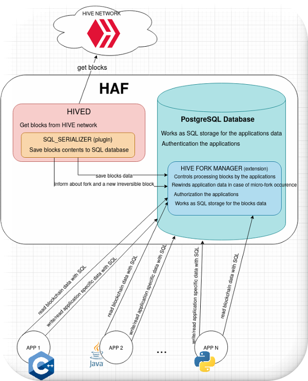

# Overview of the Hive Application Framework (HAF)
The Hive Application Framework was developed to simplify the creation of highly scalable, blockchain-based applications. HAF-based apps are naturally resilient against blockchain forks because HAF contains a mechanism for automatically undoing data generated by forked out blocks.

HAF servers act as an intermediary between the Hive network and Hive applications. HAF-based applications do not normally read data directly from Hive nodes (aka hived process) via a pull model. Instead, HAF applications receive blockchain data via a push model: a hived node is configured with a *sql_serializer* plugin that processes each new block as it arrives at the hived node and writes the associated blockchain data (transactions, operations, virtual operations, etc) to a Postgres database. The server where this Postgres database is running is referred to as a HAF server. 

Multiple HAF-based apps can run on a single HAF server, sharing the same HAF database, with each HAF app creating a separate schema where it stores app-specific data. 

Since HAF servers receive their data via a push model, they impose a fixed amount of load on the hived node that supplies blockchain data, regardless of the number of HAF apps running on the server. In other words, while too many apps may load down the postgres database and affect the performance of other apps, the hived node supplying the data should continue to function without any problems.

HAF-app users publish transactions on the Hive network when they want to send data to a HAF-based app. Typically these transactions contain custom_json operations that contain information specifically customized for one or more HAF apps. These operations then get included into the blockchain and thereafter inserted into the HAF database for further processing by any HAF application that is watching for those particular operations. In other words, user actions aren't directly sent to app servers. Instead, they are published to the hived peer-to-peer network, included into the decentralized storage of the Hive blockchain, and then indirectly processed by HAF servers reading data from the blockchain.

An understanding of Hive's custom_json operations is critical to developing an interactive Hive app. A custom_json operation allows a user to embed one or more pieces of arbitrary json data into a Hive transaction. Interactive hive apps can utilize this feature to create a set of "commands" that their app recognizes and will process when a user publishes a transaction containing those commands.



The image above shows the main components of a HAF installation:
* **HIVED**
  HAF requires a hived node which syncs blocks with other hived nodes in the Hive peer-to-peer network and pushes this data into the HAF database. This hived node doesn't need to be located on the HAF server itself, although in some cases this may allow for faster filling of a HAF database that needs to be massively synced (i.e. when you need to fill a database with a lot of already-produced blockchain blocks).
* **SQL_SERIALIZER**
  sql_serializer is the hived plugin which is responsible for pushing the data from blockchain blocks into the HAF database. The plugin also informs the database about the occurrence of microforks (in which case HAF has to revert database changes that resulted from the forked out blocks). It also signals the database when a block has become irreversible (no longer revertable via a fork), so that the info from that block can be moved from the "reversible" tables inside the database to the "irreversible" tables.
  Detailed documentation for the sql_serializer is here: [src/sql_serializer/README.md](./src/sql_serializer/README.md)
* **PostgreSQL database**
  A HAF database contains data from blockchain blocks in the form of SQL tables (these tables are stored in the "hive" schema inside the database), and it also contains tables for the data generated by HAF apps running on the HAF server (each app has its own separate schema to encapsulate its data). The system utilizes Postgres authentication and authorization mechanisms to protect HAF-based apps from interfering with each other.
* **HIVE FORK MANAGER** is a PostgreSQL extension that implements HAF's API inside the "hive" schema. This extension must be included when creating a new HAF database. This extension defines the format of block data saved in the database. It also defines a set of SQL stored procedures that are used by HAF apps to get data about the blocks. The SQL_SERIALIZER dumps blocks to the tables defined by the hive_fork_manager. This extension defines the process by which HAF apps consume blocks, and ensures that apps cannot corrupt each other's data. The hive_fork_manager is also responsible for rewinding the state of the tables of all the HAF apps running on the server in the case of a micro-fork occurrence. Detailed documentation for hive_fork_manager is here: [src/hive_fork_manager/Readme.md](./src/hive_fork_manager/Readme.md)

# HAF Server Requirements
## Environment
1. Tested on Ubuntu 20.04
2. postgresql server dev package: `sudo apt-get install postgresql-dev-12`
3. ssl dev package:               `sudo apt-get install libssl-dev`
4. readline dev package:          `sudo apt-get install libreadline-dev`
5. pqxx dev package:              `sudo apt-get install libpqxx-dev`

## PostgreSQL cluster
HAF is intended to run on postgres version 14 or higher.

# Manually building HAF
Note: below are the instructions for manually building HAF and deploying it directly on a server, but users who are only planning to operate a HAF server or develop HAF apps, but don't plan to actively develop the base HAF layer itself, may want to skip this section and follow the more simplified procedure further down in this document for building and deploying a HAF-based server running inside a docker container.

CMake and ninja are used to build the project (you will typically need to install ninja on your system). The procedure presented below will build all the targets from the HAF repository and the `hived` program from the submodule `hive`. You can pass
the same CMake parameters which are used to compile the hived project ( for example: -DCLEAR_VOTES=ON -DBUILD_HIVE_TESTNET=OFF -DHIVE_LINT=OFF -GNinja).

1. `git submodule update --init --recursive`
2. create build directory, for example in sources root: `mkdir build`
3. `cd build`
4. `cmake -DCMAKE_BUILD_TYPE=Release .. -GNinja`
5. `make`

### Choose a version of Postgres to compile with
CMake variable `POSTGRES_INSTALLATION_DIR` is used to point to the installation folder
with PostgreSQL binaries. By default it is `/usr/lib/postgresql/14/bin` - place where Postgres v.14
is installed on Ubuntu. An example of choosing a different version of Postgres:
1. create build directory, for example in HAF source's root dir: `mkdir build`
2. `cd build`
3. `cmake -DPOSTGRES_INSTALLATION_DIR=/usr/lib/postgresql/13/bin ..`
4. `make`

# Setup of a directly-hosted HAF server
## 1. Configure PostgreSQL cluster
Compiled PostgreSQL plugins and extensions have to be installed in a postgres cluster. The best method
to do this is to execute the command below in the build directory (typically requires root privilieges):
- `sudo make install`

This will copy plugins to the Postgres cluster `$libdir/plugins` directory and exstensions to
`<postgres_shared_dir>/extension`.

You can check the `$libdir` with command: `pg_config --pkglibdir`, and the shared dir with `pg_config --sharedir`

### - Authorization
It is required to configure two based roles:
```
CREATE ROLE hived_group WITH NOLOGIN;
CREATE ROLE hive_applications_group WITH NOLOGIN;
```
The HAF will grant to these roles access to its internal elements in a way which gurantees security for the application data and application's execution flows.
The maintainer of the PostgreSQL cluster server needs to create roles ( users ) which inherits from one of these groups for example:
```
   CREATE ROLE hived LOGIN PASSWORD 'hivedpass' INHERIT IN ROLE hived_group;
   CREATE ROLE application LOGIN PASSWORD 'applicationpass' INHERIT IN ROLE hive_applications_group;
```
The roles which inherits from `hived_groups` must be used by `sql_serializer` process to login into the database.
Roles which inherit from `hive_application_group` shall be used by the applications.
Each app role does not have access to internal data created by other HAF app roles and cannot
modify data written by 'hived'. 'Hived' roles cannot modify the data of HAF apps.

More about roles in PostgreSQL documentaion: [CREATE ROLE](https://www.postgresql.org/docs/10/sql-createrole.html) 

Note: whenever you build a new version of the hive_fork_manager extension, you have to create a new HAF database.
There is no way currently to upgrade the schema installed in an old HAF database.

## 2. Preparing a PostgreSQL database
A newly create HAF database has to have have the hive_fork_manager extension installed. Without this extension, 'sql_serializer'
won't connect the hived node to the database. To install the extension in a database, execute the psql
command: `CREATE EXTENSION hive_fork_manager CASCADE;`. The CASCADE option is needed to automatically install additional extensions that the hive_fork_manager extension depends on.

The database should use these parameters:
ENCODING = 'UTF8' LC_COLLATE = 'en_US.UTF-8' and LC_CTYPE = 'en_US.UTF-8' 
(this is default for american english locale, it's not tested on other locale configurations).

# Testing a HAF installation
## 1. Integrations ```tests/integrations```
Integrations tests are tests that are running on a module of the project or on a system of the project's modules.
The tests do not use mock-ups to run modules/system under tests in isolation from their environment, instead
they are **integrated** with the environment, call real OS API functions, cooperate with real working servers, clients applications or databases.
### a) Functional tests ```tests/integrations/functional```
Functional tests are concentrated on testing functions of one module. They test its interface. The tests call
the functions and check the function results.
The project uses ctest to start functional tests. Tests are grouped in a tree by names and `.` as a branch separator where 'test' is the root.
For example, to start all the functional tests: `ctest -R test.functional.*`
### b) Replay tests ```tests/integrations/replay```
The test validates if a module or a system under test works correctly during and after replaying the blockchain from a block_log file.
The tests are written with python, and pytest is used as the test framework. 
### c) System tests ```tests/integrations/system```
The tests check interactions between the project's modules.
The tests are written with python, and pytest is used as the test framework.
## 2. Unit ```tests/unit```
Unit tests are used to test parts of modules in isolation from their surrounding environment. This means **all** functions called by the unit under test, which are not part of the unit itself, are **mocked**, and their results are fully controlled by the test framework.

# Directory structure
   ```
   cmake                         Contains common functions used by cmake build
   common_includes
        include                  Contains library interface header files, to share them among the project items
   doc                           Contains documentation
   hive                          Submodule containing hived project: https://gitlab.syncad.com/hive/hive
   src                           Contains sources
        applications             Contains utilities which help to develop Hive applications based on HAF
        hive_fork_manager        Contains SQL extension which implements solution for hive forks
        sql_serializer           C++ hived plugin which is compiled together with hived
        transaction_controllers  library with C++ utilities to control Postgres transactions 
   tests                         Contains tests for HAF
        integration              Folder for non-unit tests like functional or system tests
          functional             Contains functional tests
          replay                 Tests which checks replaying HAF from block_log file
          system                 Tests which check interactions between hived internals, sql_serializer, hive_fork_mnager and an application
        unit                     Contains unit tests and mocks
            mockups              Contains mocks 
   ```

There is also a `generated` directory inside the build directory that contains autmatically generated headers which can be included in the code with ```#include "gen/header_file_name.hpp"```

# Predefined cmake targetes
To simplify adding new modules to the project, the build system introduces macros which defines few types of project items. 

## 1. Static C++ library
To setup compiler and linker setting to generate static library use macro:

`ADD_STATIC_LIB` with parameter
- target_name - name of the static lib target

The macro adds all *.cpp files from the directory in which the `CMakeLists.txt` file is placed ( `${CMAKE_CURRENT_SOURCE_DIR}` ) 

## 2. Run-time loaded C++ library
To setup compiler and linker setting to generate dynamicaly loaded library which will be opened
during program run-time with dlopen, use macro:

`ADD_RUNTIME_LOADED_LIB` with parameter
- target_name - name of the library target

The macro adds to compilation all *.cpp files from the directory in which the `CMakeLists.txt` file is placed ( `${CMAKE_CURRENT_SOURCE_DIR}` )

## 3. Load-time loaded C++ library
To setup compiler and linker setting to generate dynamicaly loaded library which will be loaded
by the loader during startin a program please use macro:

`ADD_LOADTIME_LOADED_LIB` with parameter
- target_name - name of the library target

The macro adds to compilation all *.cpp files from the directory in which the `CMakeLists.txt` file is placed ( `${CMAKE_CURRENT_SOURCE_DIR}` )

## 4. GTest unit test target
To add unit test based on gtest and gmoc frameworks, use macro:

`ADD_UNIT_TESTS` wit parameter
- module_name - name of test module

The macro adds to compilation all *.cpp files from the directory in which the `CMakeLists.txt` file is placed ( `${CMAKE_CURRENT_SOURCE_DIR}` ).
The test `test.unit.<module_name>` is added to ctest.

## 5. PSQL extension based on sql script
If there is a need to create psql extension ( to use CREATE EXTENSION psql command ) a cmake macro is added to cmake:
`ADD_PSQL_EXTENSION` with parameters:
- NAME - name of extension, in current source directory file <name>.control (see https://www.postgresql.org/docs/12/extend-extensions.html#id-1.8.3.18.11 ) 
- SOURCES - list of sql scripts, the order of the files is important since they are compiled into one sql script

The macro creates a new target extension.<name_of_extension>. The command 'make extension.<name_of_extension>' will create
an psql extension in `${CMAKE_BINARY_DIR}/extensions/<name>`.
To install the extension please execute 'make install'.

Warning: 'make install' will install all already built project items in the build dir. To install only one of them please build it in a separate build directory, making only the desired target. For example: `make extension.hive_fork_manager; make install;` 

# Dockerized HAF setup

HAF project supports build and start of docker images containing prepared HAF installation for use cases:

1. using a docker to start your local HAF `instance`, storing its data on host (docker container will contain built hived, configured PostgreSQL - all what you need is providing a data store location for started container).
   This usecase is mostly intended to users who want to start own HAF instance and supply it by ourselve done replay or even provided (i.e. by some Hive vendors) matching hived memory snapshot, SQL database dump and matching block_log.
2. fast start to develop own HAF application or just quickly take a look on working, already configured and ready for use HAF installation. This use case is supported by a  `data` image containing a built HAF instance together with generated data for 5M blocks taken from Hive mainnet and allows some "sanboxing". This image is a monolith - contains all items required to start HAF instance: hived binaries, Hive mainnet block_log cut up to 5M blocks and SQL database already filled by hived replay with enabled sql_serializer plugin.
   Such image can be useful for people who would like fast start playing with HAF by creating own HAF application or (probably rare case) develop HAF itself. 

## Ad 1. Building a local `instance` image.

Build local instance image supports also 2 modes: build for specified commit like also using already checked out sources.

### Building from pointed source directory

To build instance image using already checked out HAF sources you can use following commandline:

```
../haf/scripts/ci-helpers/build_instance.sh local ../haf registry.gitlab.syncad.com/hive/haf/

```

where:
`local` is specific to the image tag to be put onto built docker image
`../haf` points source directory
`registry.gitlab.syncad.com/hive/haf/` specifies a docker registry where built image can be potentially pushed (push requires additional steps)

Above command will result in creation a local docker image: `registry.gitlab.syncad.com/hive/haf/instance:instance-local`

### Building a version pointed by commit

This procedure allows to build an `instance` image by checking out given commit from source repository and next following regular `instance` imaage build (using just checked out source directory) described in previous point.
To run it, you just need to execute following statements:

```
build_instance4commit.sh <commit>

i.e.:

build_instance4commit.sh fdebe397498f814920e959d5d11863d8fe51be22 registry.gitlab.syncad.com/hive/haf/

```
Above statement will generate an image called: `registry.gitlab.syncad.com/hive/haf/instance:instance-fdebe397498f814920e959d5d11863d8fe51be22` 

## Ad 2. Sandoboxing/using or building a `data` image.

You can use one of prebuilt `data` images stored at https://gitlab.syncad.com/hive/haf/container_registry/

Of course you also can built given image `data` locally by using scripts:
- build_data4commit.sh which is able to checkout specified commit and prepare a data image for it
- build_data.sh script, which performs the same, but for pointed HAF source directory.

Examples below assume following directory structure:

```
+--- /home/haf-tester
|
+----/home/haf-tester/haf     # Already checked out Haf sources
|
+----/home/haf-tester/workdir # Working directory, where commands described below are executed

```

To build image at your local machine, you should execute following command line:

### Building from pointed source directory

```
../haf/scripts/ci-helpers/build_data.sh local ../haf registry.gitlab.syncad.com/hive/haf/
```
where:
`local` is specific to the image tag to be put onto built docker image
`../haf` points source directory
`registry.gitlab.syncad.com/hive/haf/` specifies a docker registry where built image can be potentially pushed (push requires additional steps)

Above command will result in creation a local docker image: `registry.gitlab.syncad.com/hive/haf/data:data-local`

### Building a version pointed by commit

This procedure allows to build an `data` image by checking out given commit from source repository and next following regular `data` imaage build (using just checked out source directory) described in previous point.
To run it, you just need to execute following statements:

```
../haf/scripts/ci-helpers/build_data4commit.sh <commit>

i.e.:

../haf/scripts/ci-helpers/build_data4commit.sh fdebe397498f814920e959d5d11863d8fe51be22 registry.gitlab.syncad.com/hive/haf/

```

Above command will result in creation a local docker image: `registry.gitlab.syncad.com/hive/haf/data:data-fdebe397498f814920e959d5d11863d8fe51be22`

## Starting already built HAF instance

To start own HAF instance you must have prepared a directory to store a data specific to given instance like:
a) a `config.ini` file containing all settings specific to your instance. Spawning a prebuilt HAF instance image, implies some settings like: 
  - enabled a `sql_serializer_plugin` 
  - some predefined locations of hived datadir and its shared memory file location

  Above options are passed directly to hived command line and will override your settings specified in config.ini file. Of course other settings will be respected.
  Next paragraphs will clarify how to customize i.e. shared memory file location (i.e. if someone would like to store it on ramdisk mounted on host machine)

b) blockchain directory providing a valid blockchain file(s), to be used at initial node replay
c) a directory `haf_db_store` holding data specific to docker-internal PostgreSQL instance. Thus such data will be persistent across given image restarts.

Now it should be possible to run prebuild `instance` image and to peform it, following command line could be useful:

```
../haf/scripts/run_hived_img.sh registry.gitlab.syncad.com/hive/haf/instance:instance-local --data-dir=/storage1/mainnet-5M-haf --name=haf-instance-5M --replay --stop-replay-at-block=5000000
```

Above command line is an example and can be explained as follows:
- `registry.gitlab.syncad.com/hive/haf/instance:instance-local` points your built image (in previous steps)
- `--data-dir=/storage1/mainnet-5M-haf` option enforces proper volume mapping from your host machine to started docker container, and points a data directory where hived node shall put its data
- `--name=haf-instance-5M`- is an option which allows to easy indentify your instance
- other options `--replay --stop-replay-at-block=5000000` are passed directly to hived command line

Instance starts in detached mode, (similary to service) so you can see no output directly on your console.

To inspect what your instance does, you can use a `docker logs haf-instance-5M` command.
To stop your instance you can use a `docker container stop haf-instance-5M` command.

## Accessing already started HAF instance service(s)

  Hived like every regular node, operates on several ports:
  - specific to P2P configuration, by default set to value 2001 inside docker
  - specific to HTTP communication (to support JSON web services supported by Hived instance), by default set to value 8090 inside docker
  - specific to WS communication (i.e. useful for cli_wallet interactions), by default also set to  8090 inside docker.

  Additionally, HAF docker image contains internal PostgreSQL service which is used to hold HAF data. It operates also on standard PostgreSQL port: 5432

  All above ports can be mapped to host specific values by passing dedicated options to docker run command. Refer to docker documentation for details.

  ## Access permissions specific to internal PostgreSQL instance

  1. Roles/Unix account predefined in Docker instance:
    HAF Docker image creates following unix accounts/database roles:
    - haf_admin - unix account (also able to perform sudo). It also contains a database role (called the same) which has configured SUPERUSER permissions. This role shall be used only in exceptional cases, when some administration steps really requiring SUPERUSER permission shall be performed
    - hived - unix account and also database role, which is used to spawn internal hived process. This unix account has limited rights (can't do sudo), but database role has specific rights needed to perform data write to haf_block_log database. Such role is dedicated only to hived usage and shall be not used in other cases.
    - haf_app_admin - this account is only specific to PostgreSQL database role. It has granted limited rights, which are sufficient to regular HAF application actions like creation of other application specific roles, private database scheme like also tables, views and functions defined in this scheme. Given role has declined write access to the `hive` schema (mostly internal HAF data).

  2. Accessing internal PostgreSQL held by dockerized HAF instance:
    By default internal PostgreSQL instance allows trusted connections performed by `haf_app_admin` account incoming from network class: `172.0.0.0/0` (this is default IP address range specific to docker bridge network). To connect your application to HAF instance (assuming its contaier has address: 172.17.0.2) , you should connect to: `postgresql://haf_app_admin@172.17.0.2/haf_block_log`.
    
    To perform SQL administration access to the database, most prefered way is to connect directly into docker container using bash, and by operating on haf_admin account (default one after access it) using psql tool any action specific to PostgreSQL instance can be performed. Below is specified example command line which could be used for this operation:
    ```
    docker container exec -it haf-instance-5M /bin/bash
    ```

    where:
    `haf-instance-5M` is a name of previously started docker container
    `/bin/bash` is a command to be executed after attaching container

# HAF Versioning
HAF Postgres extensions are versioned - the extension control file contains `default_version` configuration entry. The build system fills the entry with the repository git sha. The corresponding SQL script file is also named with the same version, as is required by postgres.

# Using pg_dump/pg_restore to backup/restore a HAF database
When setting up a new HAF server for production or testing purposes, you may want to load data from an existing HAF database using `pg_dump` and `pg_restore` commands, instead of filling it from scratch using hived with a replay of the blockchain data in a block_log.

One problem that arises is that pg_dump doesn't dump tables which are part of a postgres extension, and some tables in HAF are associated with the hive_fork_manager extension. So to use pg_dump to dump a HAF database, you must first temporarily disassociate these tables from the extension, then reassociate them after completing the dump of the database.

Tables can be temporarily disassociated from an extension using the command:
`ALTER EXTENSION <extension name> DROP TABLE <tabel name>;`.

*It is important to note that this command does not drop the tables from the database itself: despite the use of the term "drop" in this command, the tables themselves continue to exist and contain the same data. They are simply no longer associated with the extension, so pg_dump can now dump them to the dump file.*

After the database has been dumped, the tables can be reassociated with an extension using the command: 
`ALTER EXTENSION <extension name> ADD TABLE <tabel name>;`
This reassociation needs to be done to the original database that was dumped, and also to any database that is restored from the dumpfile using `pg_rstore`.

Hive_fork_manager has prepared scripts which disassociate and reassociate its tables: [./src/hive_fork_manager/tools/pg_dump](./src/hive_fork_manager/tools/pg_dump/readme.md). 
