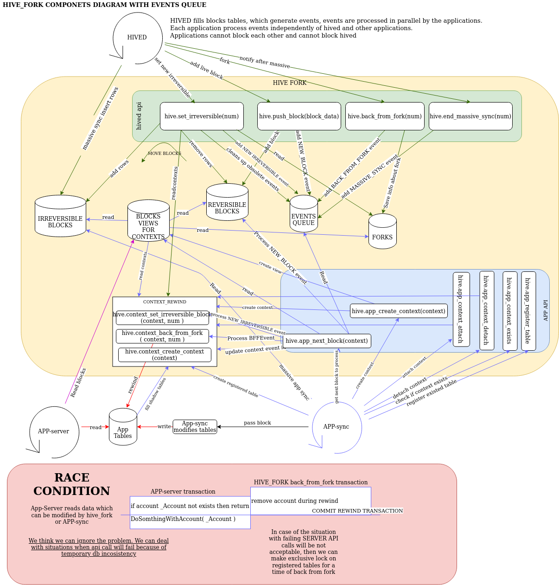
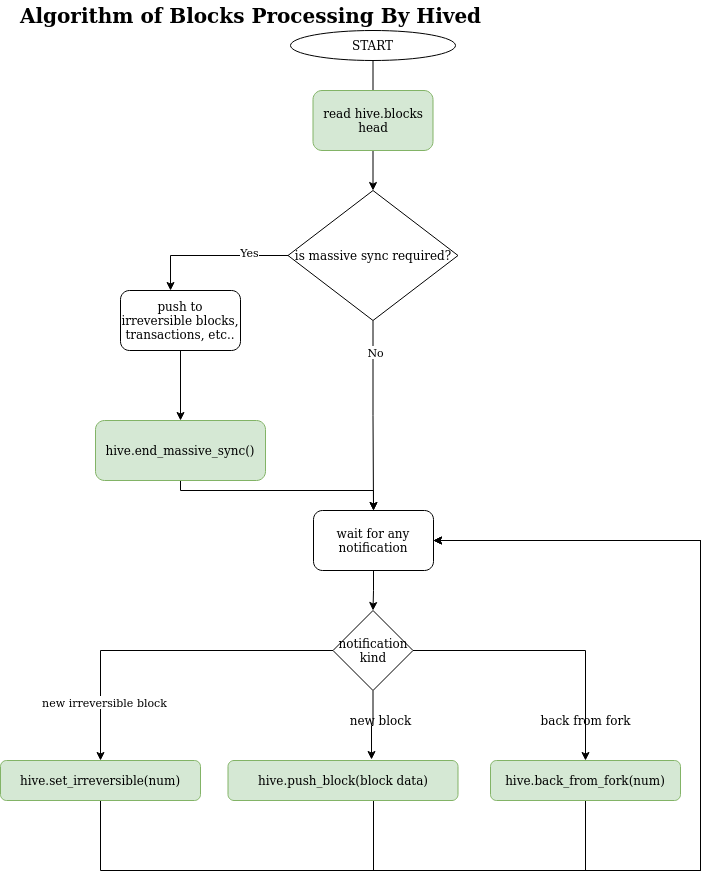
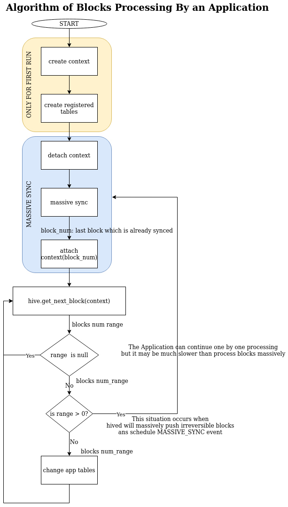
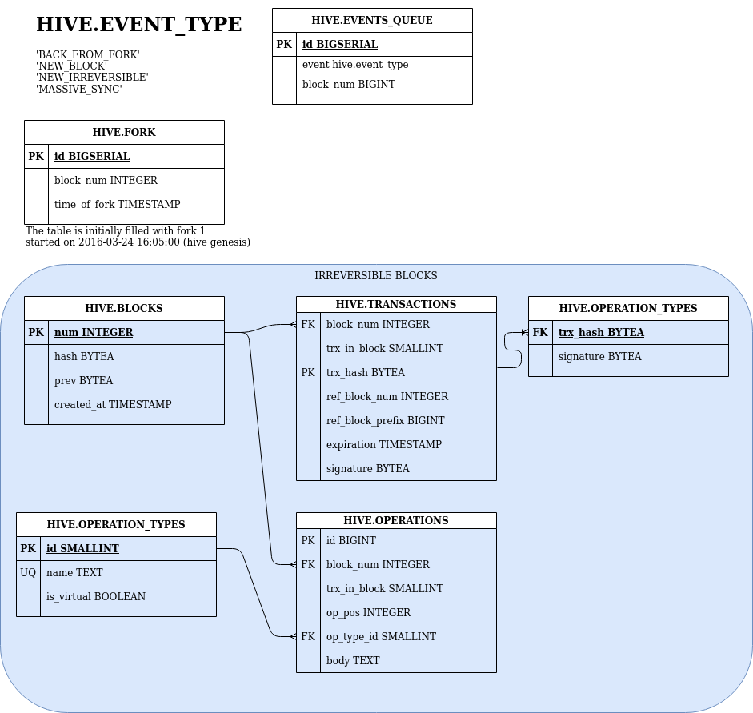
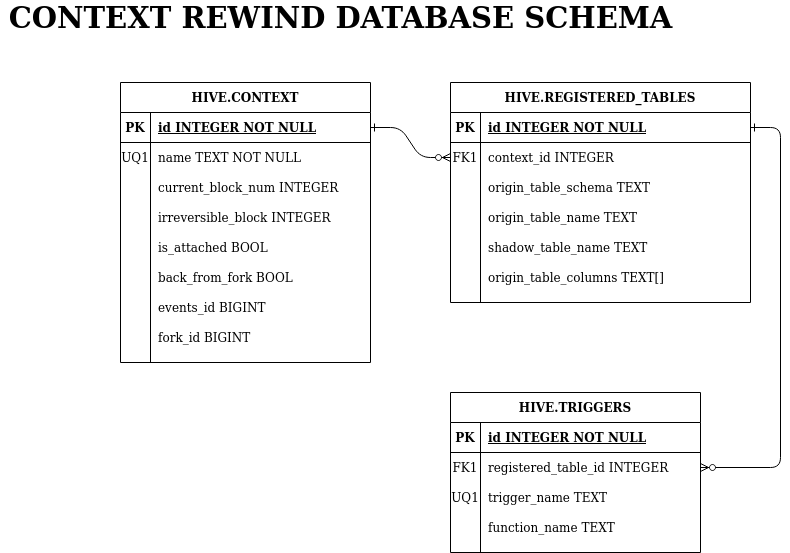

# HIVE_FORK
SQL Scripts which all together create an extension to support Hive Forks

## Installation
It is possible to install the extension in two forms - as a regular postgres extension
or as a simple set of tables and functions
### Install extension
1. create somwhere on a filesystem directory `build` and change terminal directory to it
2. `cmake <path to root of the project psql_tools>`
3. `make extension.hive_fork`
4. `make install`

The extension will be installed in the directory `<postgres_shareddir>/extension`. You can check the directory with `pg_config --sharedir`.

To start using extension in a database execute postgres command: `CREATE EXTENSION hive_fork`
### Execute sql scripts on Your database in given order:
1. context_rewind/data_schema.sql
1. context_rewind/event_triggers.sql
1. context_rewind/register_table.sql
1. context_rewind/detach_table.sql
1. context_rewind/back_from_fork.sql
1. context_rewind/irreversible.sql
1. context_rewind/rewind_api.sql
1. events_queue.sql
1. forks.sql
1. app_context.sql
1. irreversible_blocks.sql
1. reversible_blocks.sql
1. blocks_views_for_contexts.sql
1. hived_api_impl.sql
1. hived_api.sql
1. app_api.sql

An example of script execution: `psql -d my_db_name -a -f  context_rewind/data_schema.sql`

If the order of files is incorrect in documentation please look at file [src/hive_fork/CMakeLists.txt](./CMakeLists.txt)

## Architecture
All elements of the extension are placed in 'hive' schema

The postgres extension is written in events source architecture style. It means that during live syncing
hived only schedules events, and then applications process them at their own pace.

It is possible to have multiple applications which process blocks independent on each other.

Blocks data are stored in two separated, but similar tables for irreversible and potentialy reversible blocks.

An Application groups its tables into named contexts (context are named only with alphanumerical characters + underscore).
Each contexts holds information about its processed events, blocks and a fork which is now processed. These pice of information
are enaugh to create views which presents combined irreversible and reversible blocks data.
Each of the views has name started from 'hive.{context_name}_{blocks|transactions|multi_signatures|operations}_view'  
### Overview of hive_fork and its relations with applications and hived


### Hived alghorithm



### Requirements for an application algorithm


Any application must first create context, then creates its tables with inherit from hive.base. If application
wants to process some large number of irreversible blocks, then it must detach it contexts, do the sync, and attach the contexts again.
After massive processing of irreversible blocks an application has to call `hive.app_next_block` to get next block num to proces.
If NULL was returned an application must immediatly re-call `hive.app_next_block`. Any waiting (sleeps) for a new block are
executed by `hive.app_next_block`. When range of block number is returned then an application may edit its own tables and use blocks
data snaphot by asking 'hive.{context_name}_{ blocks | transactions | operations | transactions_multisig }' views. Views present
data snapshot for firt block in returned blocks range. If the range of returned blocks nums is large, then it may be worth to
back to massive sync - detach contexts, execute sync and attach the contexts - it will save triggers overhead during edition of the tables.

### Non-forking applications
It is expected tah some application won't use fork mechanism and will read only irreversible. From perspective of such non-forking app components diagram looks much simpler:


The non-forking application can read freely irreversible data and process them in its own way. There is no speccial support
for such kind of applications - hived using hive_forks fills irreversible data in the same way like when they are working with a forking application.

### REVERSIBLE AND IRREVERSIBLE BLOCKS
IRREVERSIBLE BLOCKS is information (set of database tables) about blocks which blockchain considern as irreveresible - they will never change.
You can check how th e tables look in the file [src/hive_fork/irreversible_blocks.sql](./irreversible_blocks.sql)

REVERSIBLE BLOCKS (set of database tables) is information about blocks for which blockachain is not sure if they are already irreversible, because they
may be a part of fork which will be abandoned soon. Please look at [src/hive_fork/reversible_blocks.sql](./reversible_blocks.sql)

Each application should work on a snapshot of blocks information, which is a combination of reversible and irreversible information based
on current status of the application's context - its last processed block and fork.

Because of the applications may work with different paces, the system has to hold reversible blocks information for every block num and fork not already processed by any
of the applications, this requires to construct an efficient data structure. Fortunetly the idea is quite simple - it is enaugh to add
to data inserted by hived block_num and fork id ( fork_id is a part of each reversible table ). The system controls forks ids - 
information about each fork is in hive.fork table. Moreover when 'hived' pushes a new block with function `hive.push_block`, then the system
adds information about current fork to a new reversible data. Reversible data tables can be presented in generalised form as in the example below:

| block_num| fork id | data      |
|----------|---------|-----------|
|    1     |    1    |  DATA_11  |
|    2     |    1    |  DATA_21  |
|    3     |    1    |  DATA_31  |
|    2     |    2    |  DATA_22  |
|    3     |    2    |  DATA_32  |
|    4     |    2    |  DATA_42  |
|    4     |    3    |  DATA_43  |

If application is working on fork=2 and block_num=3 ( this information is held by `hive.context` ) then its snapshot of data for example above is:

| block_num| fork id | data      |
|----------|---------|-----------|
|    1     |    1    |  DATA_11  |
|    2     |    2    |  DATA_22  |
|    3     |    2    |  DATA_32  |

It means snaphot of data for an application with context `app_context` can be obtained by filtrating blocks and forks with relativly simple SQL query like:
```
SELECT
      DISTINCT ON (block_num) block_num
    , fork_id
    , data
FROM data_reversible
JOIN hive.context hc ON fork_id <= hc.fork_id AND block_num <= hc.current_block_num
WHERE hc.name = 'app_context'
ORDER BY block_num DESC, fork_id DESC
```
Remark: The fork_id is not a part of blockchain, it is only a helpful part of hive_fork extension and may differ with any instation of the extension.

### CONTEXT REWIND
The part of the extension which is responsible to register App tables, save and rewind  operation on the tables.

An application and hived shall not use directly any function from directory [src/hive_fork/context_rewind](./context_rewind/).

An application must register those its tables, which are dependant on hive blocks.
Any table is automaticly registerd during its creation only when inherits from hive.base. 
. A table is registered into recently created context. If there is no context an exception is thrown.

```
CREATE TABLE table1( id INTEGER ) INHERITS( hive.base )
```
hive.base table is defined here: [context_rewind/data_schema.sql](./context_rewind/data_schema.sql).

Data from 'hive.base' is used by the fork system to rewind operations. Especially column 'hive_rowid'
is used by the system to distinguish between edited rows. During registartion a set of triggers are
enabled on a table, they will record any changes.
Moreover a new table is created - a shadow table which structure is the copy of a registered table + columns for operation
registered tables. A shadow table is the place where triggers records changes. A shadow table is created in 'hive' schema
and its name is created with the rule below:
```
hive.shadow_<table_schema>_<table_name>
```
It is possible to rewind all operations registered in shadow tables with `hive.context_back_from_fork`

Because triggers itself add some significant overhead for operations, in some situation it may be necessary
to temporary disable them for sake of better performance. To do this there are functions: `hive.detach_table` - to disable
triggers and 'hive.attach_table' to enable triggers. When triggers are disabled no support for hive fork is enabled for a table,
so the application should solve the situation (in most cases is should happen when blocks below irreversible are processed, so no forks happen there)

It is quite possible that the application which use the fork system will want to change the structure of the registered tables.
It is possible only when coresponding shadow tables are empty. It means before an upgrade application must be in state
in which there is no pending fork. The system will block ( rise an excpetion ) 'ALTER TABLE' command if corresponding shadow table is not empty.
When a table is edited its shadow table is automaticly adapted to a new structure ( in fact old shaped shadow table is dropped and a new one is created with a new structure )

## Database structure
### HIVE FORK


#### Reversible blocks
Tables for reversible blocks are copies of irreveersible + columns for fork_id
##### hive.blocks_reversible
##### hive.transactions_reversible
##### hive.transactions_multisig_reversible
##### hive.operations_reversible

### CONTEXT REWIND


## SQL API
The set of scripts implements an API for the applications:
### Public - for the user
#### HIVED API
The functions which are used by hived
##### hive.back_from_fork( _block_num_before_fork )
Schedules back from fork

##### hive.push_block( _block, transactions[], signatures[], operations[] )
Push new block with its transactions, their operations and signatures

##### hive.set_irreversible( _block_num )
Set new irreversible block

#### hive.end_massive_sync()
After fnishing massive push of blocks hived will invoke this metod to schedlue MASSIVE_SYNC event. The parameter `_block_num`
is a last massivly synced block - head or irreversible blocks.

#### APP API
The functions which should be used by an application

##### hive.app_create_context( _name )
Creates a new context. Context name can contains only characters from set: `a-zA-Z0-9_`

##### hive.app_next_block( _context_name )
Returns `hive.blocks_rangerange` -range of blocks numbers to process or NULL
It is a most important function for any application.
To ensure correct work of fork rewind mechanism any application must process returned blocks and modify their tables according
to block chain state on time where the returned block is a head block.

If NULL is returned, then there is no block to process or events which did not delivery blocks were processed. 

Returns range of blocks to process, if range is empty ( first and last blocks are the same ), then an application
must process the one returned block num, if range is grater than 0, (last_block -first_block) > 0, it means that hived
executed massive sync - a large number of irreversible blocks are added, and an application can process them massively without
fork control (detach context is required), or still process them one by one ( process the first_block in range and then back to `hive.app_next_block` to get
next block, but it will  be slower because of triggers overhead ).

hive.app_next_block cannot be used when context is detached - in such case an exception is thrown.

##### hive.app_context_detach( context_name )
Detaches triggers atatched to register tables in a given context, It allow to do a massive sync of irreversible
blocks without triggers overhead.

##### hive.app_context_attach( context_name, block_num )
Enables triggers attached to registered tables in a given context and set current context block num. The `block_num` cannot
be greater than top of irreversible block.

#### CONTEXT REWIND
Context rewind function shall not be used by hived and applications.

##### hive.context_detach( context_name )
Detaches triggers atatched to register tables in a given context

##### hive.context_attach( context_name, block_num )
Enables triggers attached to register tables in a given context and set current context block num 

##### hive.context_create( context_name )
Creates the context with controll block number on which the registered tables are working

##### hive.context_next_block( context_name )
Moves a context to the next available block

##### hive.context_back_from_fork( context_name, block_num )
Rewind only tables registered in given context to given block_num

#### hive.registered_table
Registers an user table in the fork system, is used by the trigger for CREATE TABLE

#### hive.create_shadow_table
Creates shadow table for given table

#### hive.attach_table( schema, table )
Enables triggers atatched to a register table.

#### hive.detach_table( schema, table )
Disables triggers atatched to a register table. It is usefull for operation below irreversible block
when fork is impossible, then we don't want have trigger overhead for each edition of a table.

## Known Problems
1. Constraints like FK, UNIQUE, EXCLUDE, PK must be DEFFERABLE, otherwise we cannot guarnteen success or rewinding changes

