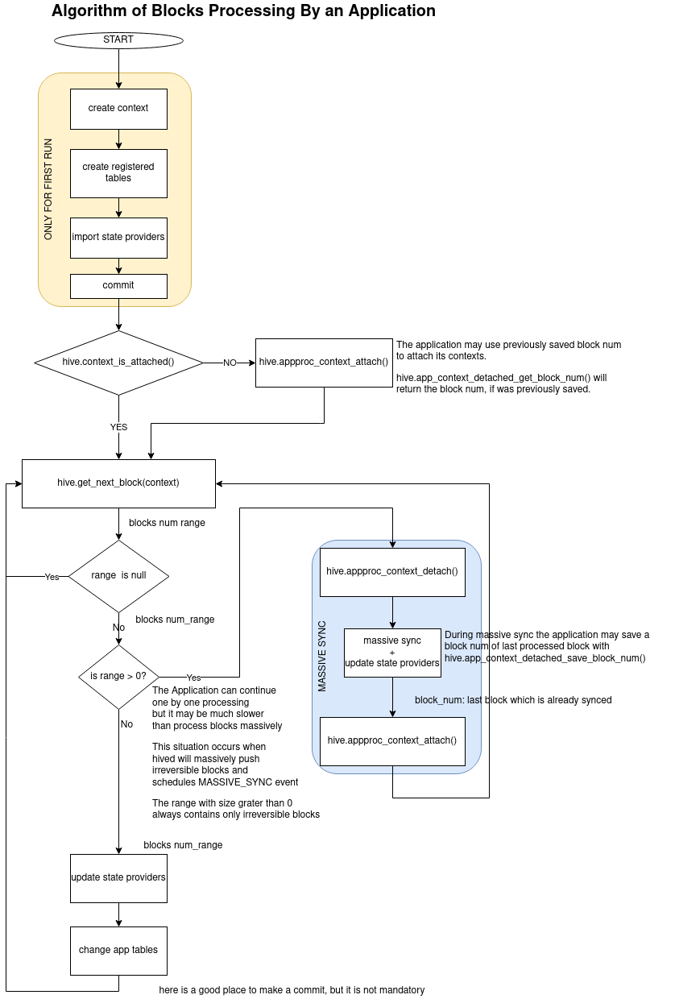

# HIVE_FORK_MANAGER
The fork manager is composed of SQL scripts to create a Postgres extension that provides an API that simplifies reverting application data when a fork switch occurs on the Hive blockchain.

## Installation
It is possible to install the fork manager in two forms - as a regular Postgres extension or as a simple set of tables and functions.

### Install fork manager as an extension
1. create somwhere on a filesystem directory `build` and change terminal directory to it
2. `cmake <path to root of the project psql_tools>`
3. `make extension.hive_fork_manager`
4. `make install`

To start using the extension in a database, execute psql command: `CREATE EXTENSION hive_fork_manager CASCADE;`. The CASCADE phrase is needed, to automatically install extensions the hive_fork_manager depends on.

### Alternatively, you can manually execute the SQL scripts to directly install the fork manager
The required ordering of the sql scripts is included in the cmake file [src/hive_fork_manager/CMakeLists.txt](./CMakeLists.txt).
Execute each script one-by-one with `psql` as in this example: `psql -d my_db_name -a -f  context_rewind/data_schema.sql`

## Architecture
All elements of the fork manager are placed in a schema called 'hive'.

The fork manager is written using an "events source" architecture style. This means that during live sync, hived only schedules events (by writing to the database), and then applications process them at their own pace (by using fork manager API queries to get alerted whenever hived has modified the block data).

The fork manager is designed to work with [transaction isolation level](https://www.postgresql.org/docs/10/transaction-iso.html) `READ COMMITTED`, which is the default for PostgreSQL.

The fork manager enables multiple Hive applications to use a single block database and process blocks completely independently of each other (applications do not need to place locks on the share blockchain data tables).

Hive block data is stored in two separated, but similar tables: irreversible and reversible blocks.

An application groups its tables into a named context. A context name can only be composed of alphanumerical characters and underscores. An application's context holds information about its processed events, blocks, and the fork which is now being processed by the application. These pieces of information
are enough to automatically create views which combine irreversible and reversible blocks data seamlessly for application queries. The auto-constructed view names use the following template: 'hive.{context_name}_{blocks|transactions|multi_signatures|operations}_view'.

### Overview of the fork manager and its interactions with applications and hived


### Hived block-processing algorithm


### Requirements for an application algorithm using the fork manager API


Only roles ( users ) which inherits from 'hive_applications_group' have access to 'The APP API', and only these roles allow
applications to work with 'hive_fork_menager'

Any application must first create a context, then create its tables which inherit from `hive.<context_name>`. The context is owned
and can be accessed only by the role which created it.

An application calls `hive.app_next_block` to get the next block number to process. If NULL was returned, an application must immediatly call `hive.app_next_block` again. Note: the application will automatically be blocked when it calls `hive.app_next_block` if there are no blocks to process. 

When a range of block numbers is returned by app_next_block, the application may edit its own tables and use the appropriate snapshot of the blocks
data by querying the 'hive.{context_name}_{ blocks | transactions | operations | transactions_multisig }' views. These view present a data snapshot for the first block in the returned block range. If the number of blocks in the returned range is large, then it may be more efficient for the application to do a "massive sync" instead of syncing block-by-block.

To perform a massive sync, the application should detach the context, execute its sync algorithm using the block data, then reattach the context. This will eliminate the performance overhead associated with the  triggers installed by the fork manager that monitor changes to the application's tables.

There is possible that application will break during massive sync - in the detached state. In such case during restart the application has to
check if its context is attached `hive.app_context_is_attached`, and if not then it has to attach it `hive.app_context_attach`. To attach the context
the application has to know num of last processed block, to save and get it there are functions `app_context_detached_save_block_num` and 'app_context_detached_get_block_num'. The
functions may be used only in the datached state, otherwise they will throw exceptions.

### Non-forking applications
It is expected that some applications will only want to process irreversible blocks, and therefore don't require the overhead associating with fork switching. Such an application should not register any table in its context. A context without registered tables (aka an 'irreversible context') will traverse only irreversible block data. This means that calls to `hive.app_next_block` will return only the range of irreversible blocks which are not already processed or NULL. Similarly, the set of views for an irreversible context only deliver a snapshot of irreversible data up to the block already processed by the application.

In summary, a non-forking application is coded in much the same way as a forking application (making it relatively easy to change between these two modes), but a non-forking app does not register its tables with its context and it is only served up information about irreversible blocks.

### Sharing tables with other applications
If an application wants to expose some of its tables for reading by other applications, then it is enaugh to grant
SELECT privilege on the tables to hive_applications_group.
```
GRANT SELECT ON my_table TO hive_applications_group;
```
:warning: An application which uses tables exposed by other application must be written taking into account that applications
works at different speed, and they may contain data computed for different forks and blocks range.

### Important notice about irreversible data
:warning: **Although reversible and irreversible block tables are directly visible to aplications, these tables should not be queried directly. It is expected that the structure of the underlying tables may change in the future, but the structure of a context's views will likely stay constant. This means that the applications which directly read the tables instead of the views may need to be refactored in the future to use newer versions of the fork manager.**

### Examples of the application
Two application examples written in Python3 were prapared. Both programs use `sqlalchemy` package as a databae engine. Programs
are very simple, both of them collect number of transaction per day - they prepare histograms in a table named `trx_histogram`.
One of the program is a non-forking application - it operates only on irreversible blocks and second application utilizes
support for blockchain forks. Applications are available here:
- forking application [doc/examples/hive_fork_app.py](./doc/examples/hive_fork_app.py)
- non-forking application [doc/examples/hive_non_fork_app.py](./doc/examples/hive_non_fork_app.py)
- forking application with a state provider [doc/examples/hive_accounts_state_provider.py](./doc/examples/hive_accounts_state_provider.py)

Actually both programs are different only in lines which create a 'trx_histogram' table - the table in forking application
inherits from`hive.trx_histogram` to register it into the context 'trx_histogram'. Look at the differences in diff format:
```diff
--- hive_non_fork_app.py
+++ hive_fork_app.py
@@ -6 +6 @@
-SQL_CREATE_HISTOGRAM_TABLE = """
+SQL_CREATE_AND_REGISTER_HISTOGRAM_TABLE = """
@@ -11 +11,2 @@
-    """
+    INHERITS( hive.{} )
+    """.format( APPLICATION_CONTEXT )
@@ -51 +52 @@
-        db_connection.execute( SQL_CREATE_HISTOGRAM_TABLE )
+        db_connection.execute( SQL_CREATE_AND_REGISTER_HISTOGRAM_TABLE )
```

To switch from non-forking application to forking one all the applications' tables have to be registered in contexts using
'hive.app_register_table' method.

### Applications without their own tables
It turned out that some applications may not require to collect data into their own specific tables, because tables of the Hive Fork Manager
contain all the data. Those applications do not require to create contexts and implement "the Application algorithm".
It is enaught to read the data for the current HEAD BLOCK using the views:
* hive.account_operations_view
* hive.accounts_view
* hive.blocks_view
* hive.transactions_view
* hive.operations_view
* hive.transactions_multisig_view

#### It is possible to get only irreversible blocks data
The applications without their own tables may be interested only in irreversible blocks data. The views listed above return
both reversible and irreversible blocks, and there is no method to distinguish which block is reversible and which is not. To get
access only to irreversible block tha pplication has to:
1. create its own context
2. immediatly detach the context
3. use the context's view -  they will return only all irreversible blocks up to the head block

## Shared lib
There are some functions that can be done efficiently only with low-level code as C/C++. Moreover, there is a need to
get some code already working in hived, and execute it by Hive Fork Manager or its applications. One example is a parsing operation JSON to get the list
of accounts impacted by the operation. Such functionality was already implemented in hived and there is no sense to implement its copy.
The folder 'shared_lib' contains an implementation of a shared library which is loaded and used by Hive Fork Manger extension.
The applications may call functions from this library with SQL interface prepared by the extension.

## States Providers Library
There are examples of applications that are generic and theirs tables could be used by a wide range of more specific applications.
The tables present in a more conviniet way some part of the blockchain state included in blocks data.
Some of the common applications are embedded inside hive_fork_manager in form of state providers: tables definitions and code which fill them.

### Basic concept
A state provider is a SQL code that contains tables definitions and methods which fill that tables. A user's application
may import a provider with SQL command `hive.app_state_provider_import( _state_name, _context )`. During import, new tables
are created and registered in the application's context. The application needs to call `hive.app_state_provider_import( range_of_blocks )`
to update tables created by imported states providers.
The import of 'state providers' must be called by the application before any call of its massive sync or hive.app_next_block. Repeating
the same import does nothing.

### A state provider structure
Each state provider is a SQL file placed in `state_providers' folder and contains functions:

* `hive.start_provider_<provider_name>( context )`
  The function gests application context name and creates tables to hold the state.
  The tables name have format `hive.<context_name>_<base table_name>` and returns list of created tables names.

* `hive.update_state_provider_<provider_name>( first_block, last_block, context )`
  The function updates all 'state providers' tables registered in the context.

* `hive.drop_state_provider_<provider_name>( _context hive.context_name )`
  The function drops all tables created by the state provider for a given context.

### How to add a new state provider
The template for creating a new state provider is here: [state_providers/state_provider.template](state_providers/state_provider.template).
You may copy it, change extension to .sql add to the CMakeLists.txt and change in the new file '<provider_name>' to a new state provider name.
After this the enum `hive.state_providers` has to be extended for the new provider name.

### State provider and forks
When the context is a non-forking one, then the tables are not registered to rewind during a fork servicing. When the context
is forking one then the tables are registered in the forking mechanism and will be rewind during forks. When the context
is changing from non-forking to forking one, then the provider's tables being also registered.

### State providers API
Applicat can import, update and drop state providers with functions:
* `hive.app_state_provider_import( state_provider, _context )`
* `hive.app_state_providers_update( _first_block, _last_block, _context )`
* `hive.app_state_provider_drop( state_provider, _context )`


### Why we introduced The States Providers instead of preparing regular applications?
The problem is that applications work with different speeds and so they work on data snapshots from different blockchain times.
If we would deliver regular applications, then all user applications won't be synchronized with delivered applications.
The user's applications may read data from prepared applications which are not fit to theirs states.

### Why we introduced The States Providers instead of extending the set of reversible/irreversible tables?
There is one big difference between reversible data and other tables - reversible data are only inserted or removed ( whole rows are inserted or removed )
, other tables can also be updated ( fields in particular row may be updated ). Whole reversible/irreversible mechanics is based on assumption
that the rows are only inserted or removed when a fork is serviced. 

### Disadvantages
Each application which imports any 'state provider' got the tables exclusively for its PostgreSQL Role. A lot of data may be
redundant in the case when a few applications use the same state provider because each of them has its own private instance of its tables.
It may look redundant for some cases, but indeed there is no other method to guarantee consistency between the provider's
state and other application's tables. Even small differences between head blocks of two applications may result in large differences between contents of their provider's tables

## Important implementation details
### REVERSIBLE AND IRREVERSIBLE BLOCKS
IRREVERSIBLE BLOCKS is a set of database tables for blocks which the blockchain considers irreversible - they will never change (i.e. they can no longer be reverted by a fork switch).
These tables are defined in [src/hive_fork_manager/irreversible_blocks.sql](./irreversible_blocks.sql). Hived may push massivly blocs data into irreversible tables and the date may be inconsistant.
Hived pushe MASSIVE_SYNC_EVENT and NEW_IRREVERSIBLE_EVENT to mark the block num which is consistend and can be read directly from the irreversible tables.

REVERSIBLE BLOCKS is a set of database tables for blocks which could still be reverted by a fork switch.
These tables are defined in [src/hive_fork_manager/reversible_blocks.sql](./reversible_blocks.sql)

Each application should work on a snapshot of block information, which is a combination of reversible and irreversible information based on the current status of the application's context (status being the state of the application's last processed block and the associated fork for that block).

Because applications may work at different speeds, the fork manager has to hold reversible blocks information for every block and fork not already processed by any of the applications. This requires an efficient data structure. Fortunately the solution is quite simple - it is enough to add
a fork id to the block data inserted by hived to the irreversible blocks table. The fork manager manages forks ids - 
information about each fork is stored in the hive.fork table. When 'hived' pushes a new block with a call to `hive.push_block`, the fork manager adds information about the current fork to a new reversible data row. Reversible data tables are presented in a generalised form in the example below:

| block_num| fork id | data      |
|----------|---------|-----------|
|    1     |    1    |  DATA_11  |
|    2     |    1    |  DATA_21  |
|    3     |    1    |  DATA_31  |
|    2     |    2    |  DATA_22  |
|    3     |    2    |  DATA_32  |
|    4     |    2    |  DATA_42  |
|    4     |    3    |  DATA_43  |

If an application is working on fork=2 and block_num=3 (this information is held by `hive.contexts` ), then its snapshot of data for the example above is:

| block_num| fork id | data      |
|----------|---------|-----------|
|    1     |    1    |  DATA_11  |
|    2     |    2    |  DATA_22  |
|    3     |    2    |  DATA_32  |

This means that the snaphot of data for an application with context `app_context` can be obtained by filtering  blocks and forks with a relativly simple SQL query like:
```
SELECT
      DISTINCT ON (block_num) block_num
    , fork_id
    , data
FROM data_reversible
JOIN hive.contexts hc ON fork_id <= hc.fork_id AND block_num <= hc.current_block_num
WHERE hc.name = 'app_context'
ORDER BY block_num DESC, fork_id DESC
```
Remark: The fork_id is not a part of the real blockchain data, it is an artifact created by the fork manager, and may differ across instances of an application running in different databases.

### EVENTS QUEUE
The events queue is a table defined in [src/hive_fork_manager/events_queue.sql](./events_queue.sql). Each row in the table represents an event. Each event is defined with its **id**, **type** and BIGINT **block_num** value. The `block_num` value has different meaning for different types of events:

|   event type     | block_num meaning                                           |
|----------------- |-------------------------------------------------------------|
| BACK_FROM_FORK   | fork id of corresponding entry in `hive.fork`               |
| NEW_BLOCK        | number of the new block                                     |
| NEW_IRREVERSIBLE | number of the latest irreversible block                     |
| MASSIVE_SYNC     | the highest number of blocks pushed massively by hived node |

Events are ordered by the **id**, thus events that happen earlier have lower ids than subsequent events. The events queue is traversed by an application when it calls `hive.app_next_block` - the lowest event from all events with an id higher than the `event_id` stored in the application's context is chosen and processed, and at the end the context's 'event_id' is updated.

#### Optimizaton of forks
There are situations when an application doesn't have to traverse the events queue and process all the events. When there are `BACK_FROM_FORK` events ahead of a context's `event_id`, then the application can ignore all events before the fork with lower `block_num` (because all such blocks have been reverted by a fork switch). Here is a diagram to show this situation:


The optimization above is implemented in [src/hive_fork_manager/app_api_impl.sql](./app_api_impl.sql) in function `hive.squash_events` (which is automatically called by the `hive.app_next_block` function).

#### Optimizations of MASSIVE_SYNC_EVENTs
MASSIVE_SYNC_EVENTs are squashed - it means that the context is moved to the newest MASSIVE_SYNC_EVENT. MASSIVE_SYNC_EVENTS ensures that older blocks
are irreversible, so there is no sens to process lowest events

#### Removing obsolete events
Once a block becomes irreversible, events related to that block which have been processed by all contexts (applications) are no longer needed by applications. These events are automatcially removed from the events queue by the function `hive.set_irreversible` (this function is periodically called by hived when the last irreversible block number changes).


### CONTEXT REWIND
Context_rewind is the part of the fork manager which is responsible for registering application tables and the saving/rewinding  operation on the tables to handle fork switching.

Applications and hived shall not use directly any function from the [src/hive_fork_manager/context_rewind](./context_rewind/) directory.

An application must register any of its tables which are dependant on changes to hive blocks.
Any table is automatically registered during its creation into context only when it inherits from hive.<context_name> table. Base table hive.<context_name> is created
always when a context is created.

```
CREATE TABLE table1( id INTEGER ) INHERITS( hive.context )
```

Data from 'hive.<conext_name>' is used by the fork manager to rewind operations. Column 'hive_rowid'
is used by the system to distinguish between edited rows. During registration, a set of triggers are
enabled on a table that record any changes. 

Moreover a new table is created - a shadow table whose structure is a copy of the registered table + columns for operation registered tables. A shadow table is the place where triggers record changes to the associated application table. A shadow table is created in the 'hive' schema and its name is created using the rule below:
```
hive.shadow_<table_schema>_<table_name>
```
It is possible to rewind all operations registered in shadow tables with `hive.context_back_from_fork`

Because the triggers add some significant overhead when modifying application tables, in some situations it may be necessary to temporary disable the triggers for the sake of better performance. To do this there are functions: 
* `hive.detach_table` to remove triggers
* 'hive.attach_table' to add triggers. 

When triggers are disabled, no support for fork management is enabled for a table,
so the application should solve the situation. In most cases this should only be done when blocks older than the last irreversible block are being processed, so no forks can happen there.

It is quite possible that applications which use the fork system will want to change the structure of the registered tables. This is possible only when coresponding shadow tables are empty. This means, before an upgrade, the application must be in a state in which there is no pending fork. The system will block ( raise an exception ) 'ALTER TABLE' command if the corresponding shadow table is not empty.

When a table is edited, its shadow table is automatically adapted to the new structure (the old shadow table is dropped and a new one is created with the new structure).

## Database structure
### Fork manager


#### Reversible blocks
Tables for reversible blocks are copies of irreveersible + columns for fork_id
##### hive.blocks_reversible
##### hive.transactions_reversible
##### hive.transactions_multisig_reversible
##### hive.operations_reversible

### CONTEXT REWIND


## SQL API
The set of scripts implements an API for the applications:
### Public - for the user
#### HIVED API
The functions which are used by hived
##### hive.back_from_fork( _block_num_before_fork )
Schedules back from fork

##### hive.push_block( _block, transactions[], signatures[], operations[] )
Push new block with its transactions, their operations and signatures

##### hive.set_irreversible( _block_num )
Set new irreversible block

#### hive.end_massive_sync(block_num)
After finishing a massive push of blocks, hived will invoke this method to schedlue MASSIVE_SYNC event. The parameter `_block_num`
is a last massivly synced block - head or irreversible blocks.

#### hive.disable_indexes_of_irreversible()
There are some indexes created by the extension on irreversible blocks data. Those indexes may slows down massive dumps
of blocks data by hived. The function drops and saves description of indexes and FK constraints created on irreversible blocks table.
Hived nay use this function before start massive sync of blocks.

#### hive.enable_indexes_of_irreversible()
It restores indexes and FK constarint dropped and saved by the function above.

#### hive.connect( _git_sha, _block_num )
The Hive node (hived) call this function each time it starts synchronization with the database. The function
clear irreversible data from inconsistent blocks (blocks which are not fully dumped during previous connection) and
saves information about the connection occurence into table hived_connections.
- **_git_sha** - is a GIT version of hived code
- **_block_num** - head block number for which the hived is synchronized

#### hive.set_irreversible_dirty()
Sets 'dirty' flag, what marks irreversible data as inconistent 

#### hive.set_irreversible_not_dirty()
Unsets 'dirty' flag, what marks irreversible data as conistent

#### hive.is_irreversible_dirty()
Read the 'dirty' flag

#### APP API
The functions which should be used by an application

##### hive.app_create_context( _name )
Creates a new context. Context name can contains only characters from set: `a-zA-Z0-9_`

##### hive.app_remove_context( _name hive.context_name )
Remove the context and unregister all its tables.

##### hive.app_next_block( _context_name )
Returns `hive.blocks_range` -range of blocks numbers to process or NULL
It is a most important function for any application.
To ensure correct work of fork rewind mechanism any application must process returned blocks and modify their tables according to block chain state on time where the returned block is a head block.

If NULL is returned, then there is no block to process or events which did not delivery blocks were processed. 

Returns range of blocks to process, if range is empty ( first and last blocks are the same ), then an application
must process the one returned block num, if range is grater than 0, (last_block -first_block) > 0, it means that hived
executed massive sync - a large number of irreversible blocks are added, and an application can process them massively without
fork control (detach context is required), or still process them one by one ( process the first_block in range and then back to `hive.app_next_block` to get
next block, but it will  be slower because of triggers overhead ).

hive.app_next_block cannot be used when context is detached - in such case an exception is thrown.

##### hive.app_context_detach( context_name )
Detaches triggers atatched to register tables in a given context, It allow to do a massive sync of irreversible
blocks without triggers overhead. The context's views are recreated to return only all irreversible data.

##### hive.app_context_attach( context_name, block_num )
Enables triggers attached to registered tables in a given context and set current context block num. The `block_num` cannot
be greater than top of irreversible block. The context's views are recreated to return both reversible and irreversible
data limited to the context's current block.

##### hive.app_context_is_attached( context_name )
Returns TRUE when a given context is attached. It may thrown an exception when there is no a context with the given context_name

##### hive.app_context_detached_save_block_num( _context_name )
The application may use the function to temporary save block num which was recently processed in the datached state. The function
will throw when is call on an attached context. The saved value is set to NULL when a context is being detached.

##### hive.app_context_detached_get_block_num( _context_name )
Returns block num recently saved in a detached state. The function will throw when the context is attached. 

#### hive.app_context_exists( context_name )
Returns TRUE when context with given name exists

#### hive.app_register_table( table_name, context_name );
Register not already registered table with name 'table_name' into context. It allow to move from 'non-forking application'
to application which support forks.

#### hive.app_get_irreversible_block( context_name DEFUALT '' )
Returns last irreversible block number, or 0 if there is no irreversible block.
When the defualt is passed (hive.app_get_irreversible_block() ), then it returns current top irreversible block num
known by hive fork manager.

#### hive.app_is_forking( context_name )
Returns boolean information if a given context is forking ( returns TRUE ) or non-forking ( returns FALSE )

#### hive.app_state_provider_import( state_provider, context )
Imports state provider into contexts - the state provider tables are created and registered
in `HIVE.STATE_PROVIDERS_REGISTERED` table.

#### hive.app_state_providers_update( _first_block, _last_block, _context )
All state provider registerd by the contexts are updated.

#### hive.hive.app_state_provider_drop( state_provider, context )
State provider become unregistered from contexts, and its tables are dropped.

#### hive.app_state_provider_drop_all( context )
All state providers become unregistered from contexts,and their tables are dropped.

#### CONTEXT REWIND
Context rewind function shall not be used by hived and applications.

##### hive.context_detach( context_name )
Detaches triggers atatched to register tables in a given context

##### hive.context_attach( context_name, block_num )
Enables triggers attached to register tables in a given context and set current context block num 

##### hive.context_create( context_name, forkid, irreversible_block )
Creates the context with controll block number on which the registered tables are working. The 'fork_id' and
'irreversible_block' are used only by application api.

##### hive.context_create( context_name )
Removes the context: removes triggers, remove hive_row id columns from registered tables, unregister all tables, removes
base table hive.<context>

##### hive.context_next_block( context_name )
Moves a context to the next available block

##### hive.context_back_from_fork( context_name, block_num )
Rewind only tables registered in given context to given block_num

##### hive.registered_table
Registers an user table in the fork system, is used by the trigger for CREATE TABLE

##### hive.create_shadow_table
Creates shadow table for given table

##### hive.attach_table( schema, table )
Enables triggers atatched to a register table.

##### hive.detach_table( schema, table )
Disables triggers atatched to a register table. It is usefull for operation below irreversible block
when fork is impossible, then we don't want have trigger overhead for each edition of a table.

#### SHARED_LIB API

##### hive.get_impacted_accounts( operation_body )
Returns list of accounts ( their names ) impacted by the operation. 

## Known Problems
1. Constraints FOREIGN KEY must be DEFERRABLE, otherwise we cannot guarnteen success or rewinding changes - the process may temporary violates tables constraints.
   More informations about DEFERRABLE constraint can be found in PosgreSQL documentaion for [CREATE TABLE](https://www.postgresql.org/docs/10/sql-createtable.html)
   and [SET CONSTRAINTS](https://www.postgresql.org/docs/10/sql-set-constraints.html)
2. The applications usually are divided for two parts: a part which synchronizes data with blockchain, and a server
   part which responses for remote queries and reads already synchronized data. In case of micro-fork occurence, during rewinding data
   a race conditions is possible between synchronization process and the server, for example the server may make some action
   when some 'Account' exsits, but the 'Account' is being removing by the micro-fork rewind code:
   
   In a such case as at the picture above the server response for a query will fail . At the moment there is an assumption
   that we can accept this situation because next query will be serviced normally. If it won't be acceptable, then we
   can make exclusive lock on registered tables for a time of back from micro-fork, but the consequences would be dramatic,
   including possibility of stopping whole HAF node by a wrongly written application. 
      

    
## Other architectures which were abandoned
### C++-based extension for fork management
There was a hope that an extension written in C/C++ can be more performant and that access to a lower level of PostgreSQL could give some benefits.

The most important problem faced by the fork manager is to rewind reversible changes in a way which does not violate constraints on the application tables. The C++-based extension was implemented by encoding changed blobs of rows from the registered tables into byte arrays and saving them in a separated table in the order in which the changes occurred (actually a stack of changed rows was implemented). The extension was
implemented and then abandoned with the [commit](https://gitlab.syncad.com/hive/psql_tools/-/commit/e6ac13be5d137fe0de5d7fe916905a9b97a11bdc).

There were a few reasons to retreat from the C/C++-based fork manager extension:
1. The extension could cause a crash not only in the client connection but also in the main PostgreSQL server process (this occurred multiple times during development).
2. The documentation for PostgreSQL C interface is terse, and for some details PostgresSQL source code needed to be analyzed.
3. There was a doubt about portability of such an extension between different versions of PostgreSQL, indeed the extension was working with PostgreSQL 10, but did not work with PostgreSQL 13.
4. It turned out that it was impossible to execute some actions only with the C iterface and executing some SQL queries from the C++ code was required.
5. It turned out that the C/C++ extension was slower than the current SQL implementation in every test. The report is [here](https://gitlab.syncad.com/hive/psql_tools/-/blob/c1140df5f72a29df4d3d26d95f63e52595702c3c/doc/Performance.md)
6. The C/C++ version was more complicated than the SQL version. The implementation of rewinding reversible operations in C++ took more than 3 weeks, whereas implementation of similar functionality with SQL took a week.
   
### SQL extension with one stack of changes ( no shadow tables )
It turned out that it is impossible to implement with SQL a similar stack of changed rows as was implemented in the C++ extension.

There is no method to take and save a blob of a table's row in a generic form, so it is not possible to have a common table for all changes from different tables.


### SQL extension without events queue
When the SQL method of rewinding reversible tables was implemented (this part is now named `context_rewind`), there was a noble idea to use it for rewinding both the applications tables and the tables filled directly by hived. This would make for a relatively simple implementation of the whole extension - hived would have its tables registered in its context and in case of a fork switch, the block tables would be reverted.

Unfortunately, during analysis, it was found that this kind of architecture will require the use of locks on hived's tables to solve race condition between reading of hived tables by the applications and modifications to them by hived. 

Introducing locking would make hived's operation dependent on the quality of the applications operating on the data - how fast they will commit transactions to release their locks on the data being written by hived. Moreover, the applications become dependant on each other, because one application may block hived and other applications would then not get new live blocks while that application blocked hived.
